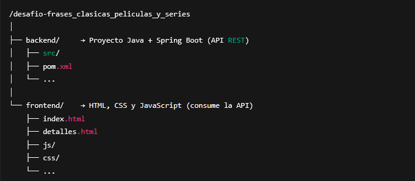
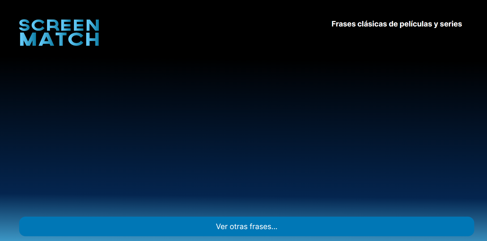
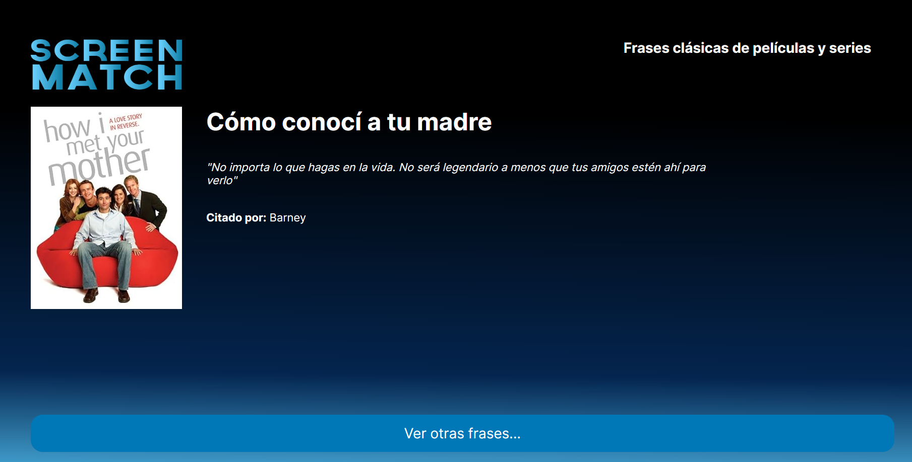

🎬 Frases Clásicas de Películas y Series — Front + Back Completo

Este proyecto corresponde al desafío final del curso “Programación: Consolidando los Conocimientos” de Alura.
Incluye backend en Java con Spring Boot y frontend en HTML/CSS/JS, funcionando de manera integrada.

🚀 Descripción del Proyecto

La aplicación permite consultar frases clásicas de películas y series.
El frontend realiza peticiones a la API REST construida en Java, mostrando frases aleatorias o la lista completa según la funcionalidad implementada.

El objetivo del desafío era:

Construir una API REST completa con Spring Boot.

Persistir datos utilizando Spring Data JPA.

Consumir esta API desde un frontend simple.

Integrar ambos proyectos y dejarlos funcionando en conjunto.

🗂️ Estructura del Proyecto

🖥️ Cómo ejecutar el proyecto
▶️ 1. Levantar el backend (Java + Spring Boot)

Abre la carpeta backend en tu IDE (IntelliJ / VSCode con plugin / Eclipse).

Ejecuta la clase principal:
DesafioFrasesApplication.java

La API quedará disponible en:
http://localhost:8080

🌐 2. Ejecutar el frontend

Abre la carpeta frontend en VS Code.

Instala la extensión Live Server, si no la tienes.

Clic derecho sobre index.html → Open with Live Server

El frontend estará disponible en:
http://127.0.0.1:5500

🖼️ Vistas de la Aplicación
🔹 Estado inicial (sin API integrada)

La aplicación mostrará un estado base si la API aún no está en funcionamiento:

🔹 Proyecto completo y funcionando

Una vez desarrollada la API y conectada al frontend, la aplicación mostrará las frases obtenidas desde el backend:

📌 Tecnologías utilizadas
Backend

Java 21

Spring Boot

Spring Web

Spring Data JPA

H2 / MySQL (según la configuración)

Maven

Frontend

HTML5

CSS3

JavaScript Vanilla (fetch API)

Live Server (para desarrollo local)

🎯 Resultado Final

Proyecto completo y funcional que integra API REST + Frontend, consumiendo datos reales almacenados en la base de datos.

Este desafío consolida conocimientos de:

✔️ Java
✔️ Spring Boot
✔️ APIs REST
✔️ Persistencia de datos
✔️ Fetch en JavaScript
✔️ Integración Front–Back

👏 ¡Desafío Final Completado!
